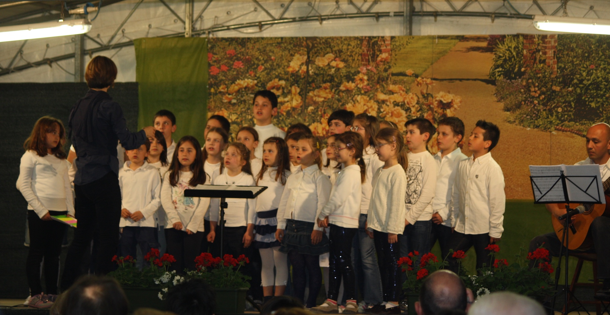

<link rel="stylesheet" href="{{ "/assets/css/gallery.prefixed.css" | relative_url }}" />

  

  

  

  <figure class="item">
    <h1>1</h1>
    
  </figure>

  <figure class="item">
    <h1>2</h1>
  </figure>

  <figure class="item">
    <h1>3</h1>
  </figure>

  

    <a href="#item-1" class="control-button">•</a>
    <a href="#item-2" class="control-button">•</a>
    <a href="#item-3" class="control-button">•</a>
  

